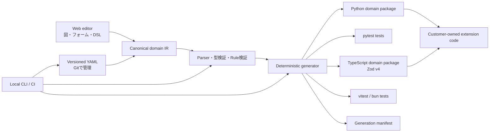

# 05. Code Generation and Architecture

## 1. 構成案



## 2. 生成契約

### 必須の性質

- **決定的:** 同一モデル、設定、generator版ならファイル内容が同一。
- **差分生成:** 新規・更新・削除予定を実書き込み前に表示。
- **所有境界:** Generated領域は再生成可能。Extension領域はツールが更新しない。
- **読みやすさ:** 出力に意味のあるクラス名、メソッド名、docstring、型注釈を付ける。
- **一般的な実行:** 標準Pythonツールと通常のCIで動く。
- **削除の安全性:** モデルから削除したファイルは自動削除せず、stale候補として警告するか明示的承認を求める。例外は `tests/generated/` の生成テストで、生成したときのまま（hashが一致）なら `generate` が削除する（消えたコードをimportして必ず失敗するため）。手で編集してあれば何も書かずに止まり、`--prune --force` を求める。
- **読める整形:** 生成コードは1行100文字以内に収める。折り返しは括弧の中だけで行い、条件をくくる括弧をタプルに変えない（`if not (a or b,):` は常に真になり、ルールが働かなくなる）。TypeScript では `return` / `throw` の直後や `=>` の前で改行しない（自動セミコロン挿入で意味が変わるため）。1つの名前だけの import 行は100文字を超えても折り返さない（一般的な整形ツールと同じ）。Python の出力は ruff format と同じ形に折り返し、`ruff format --check` と `ruff check` を通す（§4.1）。
- **失敗時の原子性:** 生成エラーやユーザー取消しで一部ファイルだけ更新された状態を作らない。

### 生成ディレクトリ案

```text
src/<package_name>/
  generated/
    domain/
      entities.py
      value_objects.py
      aggregates.py
      errors.py
      events.py
      commands.py
      invariants.py
    application/
      use_cases.py
      ports.py
    model_manifest.json
  extensions/
    domain/
    application/
tests/
  generated/
```

顧客の好みでモジュール分割を設定できるようにするが、MVPでは出力構造を限定し、安定した拡張契約を優先する。

## 3. 手書きコードとの接続

- 自動生成されたクラスに顧客コードを直接追記させない。
- 生成ファイルから呼び出す抽象Port、拡張関数、基底クラスのいずれかを提供する。
- 拡張ポイントは名前と型をモデルに登録し、未実装箇所を診断する。
- GeneratorのバージョンアップでExtension APIを破壊する場合は変更前に差分を出す。
- 生成物への手編集を検知した場合、黙って上書きせず差分を表示して停止する。

## 4. Python出力の初期方針

- Pythonを最初の生成対象にする。
- Python 3.11以上を暫定ターゲットとし、正式サポート範囲はPoC開始前に固定する。
- 型注釈、標準的なEnum、UUID、datetime、Protocol / ABC等を利用する。
- Value Objectは不変を既定にする。
- Entity / Aggregateは外部からの直接変更を避け、名前付き操作を通す。
- Pydantic v2を使う生成Profileを初期候補とする。標準ライブラリだけのProfileを求める顧客数をPoCで調べる。
- 生成結果はpytestで実行でき、mypyまたはpyrightのどちらを公式サポートするかを定める。
- Domain ErrorはHTTPやFastAPIの型から独立させる。
- 時計、ID生成、Repository、イベント通知などの外部依存はPortまたは明示入力にする。

### 4.1 生成コードの規約と互換性（2026-10-03）

監査の根拠・出典・従わなかった項目は [docs/09 §15](09-implementation-decisions.md)。

- **検証の保証**: 生成モデル（`DomainModel` を継承する Value Object・Entity・Aggregate・イベント・コマンド）は、どの経路で新しい状態を作っても検証する。対象はコンストラクタ、`model_validate`、`model_copy(update=...)`、`_replace`、`copy.replace`。制約違反は `ConstraintViolation`（`__cause__` に Pydantic の `ValidationError`）、Invariant 違反は宣言した Domain Error になる。検証しないのは `model_construct` だけで、検証済みのデータを再び読み込むときの逃げ道として残す。
- **型と書式**: Enum は `StrEnum`。定数は `Final`。`Transition`・`StateGuard`・`Rule`・`RecordedResult` は `@dataclass(frozen=True, slots=True)`。生成モジュールは `__all__` で公開名を示し、`src/<package>/py.typed` を雛形として作る。
- **イベント**: 各イベントは `event_type: Literal["<Context>.<Event>"]` を持つ（既定値つきなので、作るときに渡す必要はない）。コンテキストの `events.py` にはタグ付き共用体 `AnyEvent` と `parse_event(data)` があり、`model_dump()` / `model_dump(mode="json")` の結果からイベントを復元できる。イベントのフィールド名 `event_type` と型名 `AnyEvent` は予約されていて、使うと生成が止まる。
- **整形**: 出力は `ruff check`（規則は例の `pyproject.toml`）と `ruff format --check` を通る。mypy は `--strict` に Pydantic プラグイン（`init_typed`・`init_forbid_extra`）を加えた設定で通る。

#### 移行の注意（generator 0.1.0 のこの版から）

公開 API の名前と引数は変えていない（`ddd diff` の破壊的変更の一覧には出ない）。ただし次の挙動が変わる。

| 変更 | 影響 | 対応 |
|---|---|---|
| `model_copy(update=...)` が検証する | 不正な値を渡すと `ConstraintViolation` か Domain Error が送出される。以前は黙って不正なインスタンスを返していた | 例外が出た箇所は、もともと不正な状態を作っていた。値を直すか、状態の変更をモデルの操作に置き換える |
| Enum が `StrEnum` | `str(Status.OPEN)` と f-string が `"open"` になる（以前は `"Status.OPEN"`）。比較・`.value`・JSON は同じ | 表示に `str(member)` を使っていたコードを確かめる |
| イベントに `event_type` | `model_dump()` の結果と JSON に `event_type` が増える。既定値があるので、`event_type` のない古い形の dict もクラスの `model_validate` で読める。他のシステムが dict のキーを厳密に検査していれば影響する | 保存済みイベントは `parse_event` で読み直せる（`event_type` がなければ、その dict を書いたクラスの `model_validate` を使う） |
| `ConstraintViolation` の連鎖 | `__cause__` が `ValidationError` になる（以前は `None`）。`details["errors"]` から各エラーの `url` がなくなる | `url` を参照していたコードを外す |
| dataclass の `slots=True` | `Transition` などに属性を追加できない（frozen なので以前もできなかった）、`__dict__` がない | なし（`__dict__` を使っていた場合だけ `dataclasses.asdict` に変える） |
| `__all__` | `from <module> import *` は `__all__` の名前だけを取り込む。mypy / pyright は生成モジュールが import しただけの名前（例えば events.py の `UUID`）を公開名とみなさない | 型や関数は、定義しているモジュールから import する |
| `py.typed` | 新しい雛形として作られる。既にあれば触らない | なし |

## 5. ドメインコード生成の意味論

### Invariant

1. 入力フィールドの型・制約を検証する。
2. Invariant式を評価する。
3. 違反時は宣言されたDomain Errorを送出し、無効インスタンスを返さない（`details["rule"]` にルール名）。
4. 状態遷移時は候補状態を作り、全Invariantを通過した場合だけ結果を確定する。
5. シナリオの値から違反する値を導けるInvariantには、それを確かめるテストを生成する（`tests/generated/test_<context>_invariants.py`）。

### StateGuard

- Guardオブジェクトまたは等価な型付きAPIを生成する。
- `checks()`でboolを返す。
- `assert_holds()`で条件成立時は継続し、違反時は宣言Errorを送出する。`assert`はPythonの予約語として扱う。
- 操作側がGuardを自動適用するか、呼び出し側へ委ねるかをモデル上で明示する。
- Guard条件とOperationの対応をドキュメントへ出す。

### Use Case

- 入力検証、Port呼び出し、Domain操作、保存、イベント公開順を明示する。
- Domain操作をHTTP handlerに直接結合しない。
- トランザクション境界とイベント公開タイミングの保証を設定に記録する。
- 再試行がある処理（`retry: true`）はidempotency keyがなければエラーにする。
- `idempotency_key` を持つUse caseは `IdempotencyStore` Portで成功した結果をキーごとに記録し、同じキーの2回目は手順を実行せず記録した結果を返す。記録はコミット前に同じトランザクションの中で行う。

## 6. WebとCLIの責務

### Web SaaS

- モデル編集、図、共同レビュー、診断、ドキュメント表示、ユーザー・課金管理を担う。
- 顧客のソースコードやSecretを既定で保存しない。
- Webでの生成はダウンロード可能なレビュー用結果に限り、顧客リポジトリへの書き込みには明示承認を要する。

### Local CLI

- モデル検証とコード生成の正規実行環境。
- オフライン利用可能。Webログインを必須にしない基本機能を提供する。
- CI上で固定版を実行し、モデルと出力の差分を検査する。
- ライセンスや有料機能確認で通信する場合は、送信データと頻度を明記し、失敗時の動作を契約する。

## 7. AI拡張の位置づけ

- AIはモデルから欠けた意味を推測して確定しない。
- 曖昧な箇所を質問し、回答をモデル差分へ反映する。
- AI生成コードにはシナリオ由来テスト、未カバー条件、推測箇所を添付する。
- 生成コードの所有権、学習利用、外部送信、保持期間をプランと設定で明示する。
- AIなしでもモデル検証と決定的生成が成立する。

## 8. TypeScript出力（Zod）

`generation.target: typescript` のとき、同じモデル・同じ意味論から TypeScript を生成する。決定・理由・Python との違いは [docs/09 §14](09-implementation-decisions.md)。

### 実行環境と依存

- TypeScript（strict、ESM / `module: NodeNext`、`verbatimModuleSyntax`、`exactOptionalPropertyTypes`、`noUncheckedIndexedAccess`、`noUnusedLocals`）。生成物は `tsc --noEmit` をこの設定で通る。
- 実行時の依存は `zod`（v4）と `decimal.js` だけ。DDD Presenter のランタイムライブラリには依存しない（共通部分は `generated/runtime.ts` として生成する）。
- テストは vitest（既定）か `bun test`（`generation.typescript.test_runner`）。初回だけ `package.json`・`tsconfig.json` を作り、以後は顧客所有。

### 生成物と所有

```text
src/<package>/generated/runtime.ts        # 値のスキーマ、DomainError、Entity / AggregateRoot、Transition、StateGuard、ポート、dispatch
src/<package>/generated/{adapters,testing,index}.ts
src/<package>/generated/<context>/domain/{errors,enums,value-objects,entities,aggregates,events,commands,rules}.ts
src/<package>/generated/<context>/application/{ports,use-cases,policies}.ts
src/<package>/generated/<context>/{testing,index}.ts, README.md
src/<package>/generated/model_manifest.json
src/<package>/extensions/<context>/{extensions,translators}.ts   # 顧客所有（初回のみ）
tests/generated/<context>-<name>.test.ts
```

手編集の検知、stale の扱い（生成したままの `tests/generated/` は削除、ソースは `--prune`）、`ddd.lock`、マニフェストは Python と同じ。破壊的変更の検出は、生成した `.ts` の export（クラス・関数・定数・型）とクラスの公開メンバーの引数を比べる。

### ドメインの意味論の対応

| 意味論 | TypeScript |
|---|---|
| Value Object | `z.strictObject(...).readonly()` のスキーマと推論型。正規化（`trim` / `toLowerCase` / `toUpperCase`）→ 制約 → Invariant の順。`X.create(input)` / `X.parse(unknown)`。結果は凍結したオブジェクト |
| Entity / Aggregate | 不変のクラス（`readonly` フィールド、`Object.freeze`）。`X.from(input)` がスキーマで検証し、construct の Invariant を評価する。コンストラクタは private |
| Invariant | クラスの private メソッド。違反は宣言した Domain Error で、`details.rule` にルール名と識別子が入る。制約違反は `ConstraintViolation`（`details.issues` に Zod の指摘） |
| 状態遷移 | 操作は `Transition<T>`（新しい Aggregate と発生イベント）を返す。`changes` は遷移前の状態で評価し、候補状態は `from` を通るので construct の Invariant が評価され、続いて transition だけの Invariant を評価する |
| StateGuard | `guard(...)` が `StateGuard` を返す（`checks()` / `assertHolds()`）。`require:` は操作の最初に `assertHolds()` |
| イベント | `type: "<Context>.<Event>"` を持つ凍結したオブジェクト。`X.create(payload)`、型ガード `X.is(event)`。`when` があれば変更後の状態で評価 |
| Use case | 必要なポートだけをコンストラクタ（`deps` オブジェクト）で受け取るクラス。`execute(command): Promise<R>`。ポートは同期・非同期のどちらでも実装できる（`Awaitable<T>`） |
| トランザクション | `transaction: required` は UnitOfWork でくくり、失敗時は rollback して例外を投げ直す。`publish` はその場で、`publish_after_commit` はコミット成功後に公開 |
| 冪等性 | `IdempotencyStore` で `String(command.<key>)` ごとに成功した結果を記録（コミット前・同じトランザクション）し、同じキーでは手順を実行せず記録を返す |
| ポリシー | ハンドラクラス（`handle(event)` と、イベントバス用の `onEvent`）と `subscriptions({...})`（イベントの `type` → ハンドラ）。下流は上流の生成したイベントを名前空間 import で使う。anticorruption_layer は `<Upstream>Translator` を通す |
| 生成テスト | シナリオ、導出した違反値（`details.rule` まで確認）、冪等性、ポリシーの対応付けをテストにする。期待値の比較は `plain(...)`（Decimal は値、日時は ISO 文字列、Entity は識別子で比べる） |
