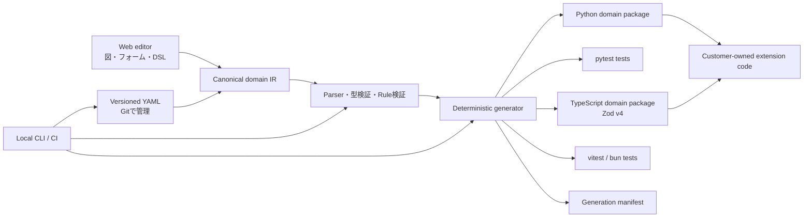

# 05. Code Generation and Architecture

## 1. 構成案



## 2. 生成契約

### 必須の性質

- **決定的:** 同一モデル、設定、generator版ならファイル内容が同一。
- **差分生成:** 新規・更新・削除予定を実書き込み前に表示。
- **所有境界:** Generated領域は再生成可能。Extension領域はツールが更新しない。
- **読みやすさ:** 出力に意味のあるクラス名、メソッド名、docstring、型注釈を付ける。
- **一般的な実行:** 標準Pythonツールと通常のCIで動く。
- **削除の安全性:** モデルから削除したファイルは自動削除せず、stale候補として警告するか明示的承認を求める。例外は `tests/generated/` の生成テストで、生成したときのまま（hashが一致）なら `generate` が削除する（消えたコードをimportして必ず失敗するため）。手で編集してあれば何も書かずに止まり、`--prune --force` を求める。
- **読める整形:** 生成コードは1行100文字以内に収める。折り返しは括弧の中だけで行い、条件をくくる括弧をタプルに変えない（`if not (a or b,):` は常に真になり、ルールが働かなくなる）。TypeScript の生成物は Prettier（printWidth 100）の出力そのもの（§8。`return` / `throw` の直後や `=>` の前で改行しないことも Prettier の規則に含まれる）。1つの名前だけの import 行や長い文字列リテラルは、Prettier と同じく100文字を超えても折り返さない。 Python の出力は ruff format と同じ形に折り返し、`ruff format --check` と `ruff check` を通す（§4.1）。
- **失敗時の原子性:** 生成エラーやユーザー取消しで一部ファイルだけ更新された状態を作らない。

### 生成ディレクトリ案

```text
src/<package_name>/
  generated/
    domain/
      entities.py
      value_objects.py
      aggregates.py
      errors.py
      events.py
      commands.py
      invariants.py
    application/
      use_cases.py
      ports.py
    model_manifest.json
  extensions/
    domain/
    application/
tests/
  generated/
```

顧客の好みでモジュール分割を設定できるようにするが、MVPでは出力構造を限定し、安定した拡張契約を優先する。

## 3. 手書きコードとの接続

- 自動生成されたクラスに顧客コードを直接追記させない。
- 生成ファイルから呼び出す抽象Port、拡張関数、基底クラスのいずれかを提供する。
- 拡張ポイントは名前と型をモデルに登録し、未実装箇所を診断する。
- GeneratorのバージョンアップでExtension APIを破壊する場合は変更前に差分を出す。
- 生成物への手編集を検知した場合、黙って上書きせず差分を表示して停止する。

## 4. Python出力の初期方針

- Pythonを最初の生成対象にする。
- Python 3.11以上を暫定ターゲットとし、正式サポート範囲はPoC開始前に固定する。
- 型注釈、標準的なEnum、UUID、datetime、Protocol / ABC等を利用する。
- Value Objectは不変を既定にする。
- Entity / Aggregateは外部からの直接変更を避け、名前付き操作を通す。
- Pydantic v2を使う生成Profileを初期候補とする。標準ライブラリだけのProfileを求める顧客数をPoCで調べる。
- 生成結果はpytestで実行でき、mypyまたはpyrightのどちらを公式サポートするかを定める。
- Domain ErrorはHTTPやFastAPIの型から独立させる。
- 時計、ID生成、Repository、イベント通知などの外部依存はPortまたは明示入力にする。

### 4.1 生成コードの規約と互換性（2026-10-03）

監査の根拠・出典・従わなかった項目は [docs/09 §15](09-implementation-decisions.md)。

- **検証の保証**: 生成モデル（`DomainModel` を継承する Value Object・Entity・Aggregate・イベント・コマンド）は、どの経路で新しい状態を作っても検証する。対象はコンストラクタ、`model_validate`、`model_copy(update=...)`、`_replace`（Pydantic 2.10 以上なら `copy.replace` も）。制約違反は `ConstraintViolation`（`__cause__` に Pydantic の `ValidationError`）、Invariant 違反は宣言した Domain Error になる。検証しないのは `model_construct` だけで、検証済みのデータを再び読み込むときの逃げ道として残す。
- **型と書式**: Enum は `StrEnum`。定数は `Final`。`Transition`・`StateGuard`・`Rule`・`RecordedResult` は `@dataclass(frozen=True, slots=True)`。生成モジュールは `__all__` で公開名を示し、`src/<package>/py.typed` を雛形として作る。
- **イベント**: 各イベントは `event_type: Literal["<Context>.<Event>"]` を持つ（既定値つきなので、作るときに渡す必要はない）。コンテキストの `events.py` にはタグ付き共用体 `AnyEvent` と `parse_event(data)` があり、`model_dump()` / `model_dump(mode="json")` の結果からイベントを復元できる。イベントのフィールド名 `event_type` と型名 `AnyEvent` は予約名で、モデルの検証が `reserved-name` を出す。
- **整形**: 出力は `ruff check`（規則は例の `pyproject.toml`）と `ruff format --check` を通る。mypy は `--strict` に Pydantic プラグイン（`init_typed`・`init_forbid_extra`）を加えた設定で通る。

#### 移行の注意（generator 0.1.0 のこの版から）

公開 API の名前と引数は変えていない（`ddd diff` の破壊的変更の一覧には出ない）。ただし次の挙動が変わる。

| 変更 | 影響 | 対応 |
|---|---|---|
| `model_copy(update=...)` が検証する | 不正な値を渡すと `ConstraintViolation` か Domain Error が送出される。以前は黙って不正なインスタンスを返していた | 例外が出た箇所は、もともと不正な状態を作っていた。値を直すか、状態の変更をモデルの操作に置き換える |
| Enum が `StrEnum` | `str(Status.OPEN)` と f-string が `"open"` になる（以前は `"Status.OPEN"`）。比較・`.value`・JSON は同じ | 表示に `str(member)` を使っていたコードを確かめる |
| イベントに `event_type` | `model_dump()` の結果と JSON に `event_type` が増える。既定値があるので、`event_type` のない古い形の dict もクラスの `model_validate` で読める。他のシステムが dict のキーを厳密に検査していれば影響する | 保存済みイベントは `parse_event` で読み直せる（`event_type` がなければ、その dict を書いたクラスの `model_validate` を使う） |
| `ConstraintViolation` の連鎖 | `__cause__` が `ValidationError` になる（以前は `None`）。`details["errors"]` から各エラーの `url` がなくなる | `url` を参照していたコードを外す |
| dataclass の `slots=True` | `Transition` などに属性を追加できない（frozen なので以前もできなかった）、`__dict__` がない | なし（`__dict__` を使っていた場合だけ `dataclasses.asdict` に変える） |
| `__all__` | `from <module> import *` は `__all__` の名前だけを取り込む。mypy / pyright は生成モジュールが import しただけの名前（例えば events.py の `UUID`）を公開名とみなさない | 型や関数は、定義しているモジュールから import する |
| `py.typed` | 新しい雛形として作られる。既にあれば触らない | なし |
| 例の mypy 設定（Pydantic プラグインの `init_typed`） | この設定を写すと、lax な変換に頼った呼び出し（`Model(id="…")` で `id: UUID` など）を mypy が型エラーにする | 正しい型で渡すか、外部のデータは `Model.model_validate(data)` で読む |
| 予約名 `event_type`（イベントのフィールド）と `AnyEvent`（型名） | これらを使っていたモデルは `reserved-name` になる | 名前を変える |

## 5. ドメインコード生成の意味論

### Invariant

1. 入力フィールドの型・制約を検証する。
2. Invariant式を評価する。
3. 違反時は宣言されたDomain Errorを送出し、無効インスタンスを返さない（`details["rule"]` にルール名）。
4. 状態遷移時は候補状態を作り、全Invariantを通過した場合だけ結果を確定する。
5. シナリオの値から違反する値を導けるInvariantには、それを確かめるテストを生成する（`tests/generated/test_<context>_invariants.py`）。

### StateGuard

- Guardオブジェクトまたは等価な型付きAPIを生成する。
- `checks()`でboolを返す。
- `assert_holds()`で条件成立時は継続し、違反時は宣言Errorを送出する。`assert`はPythonの予約語として扱う。
- 操作側がGuardを自動適用するか、呼び出し側へ委ねるかをモデル上で明示する。
- Guard条件とOperationの対応をドキュメントへ出す。

### Use Case

- 入力検証、Port呼び出し、Domain操作、保存、イベント公開順を明示する。
- Domain操作をHTTP handlerに直接結合しない。
- トランザクション境界とイベント公開タイミングの保証を設定に記録する。
- 再試行がある処理（`retry: true`）はidempotency keyがなければエラーにする。
- `idempotency_key` を持つUse caseは `IdempotencyStore` Portで成功した結果をキーごとに記録し、同じキーの2回目は手順を実行せず記録した結果を返す。記録はコミット前に同じトランザクションの中で行う。

## 6. WebとCLIの責務

### Web SaaS

- モデル編集、図、共同レビュー、診断、ドキュメント表示、ユーザー・課金管理を担う。
- 顧客のソースコードやSecretを既定で保存しない。
- Webでの生成はダウンロード可能なレビュー用結果に限り、顧客リポジトリへの書き込みには明示承認を要する。

### Local CLI

- モデル検証とコード生成の正規実行環境。
- オフライン利用可能。Webログインを必須にしない基本機能を提供する。
- CI上で固定版を実行し、モデルと出力の差分を検査する。
- ライセンスや有料機能確認で通信する場合は、送信データと頻度を明記し、失敗時の動作を契約する。

## 7. AI拡張の位置づけ

- AIはモデルから欠けた意味を推測して確定しない。
- 曖昧な箇所を質問し、回答をモデル差分へ反映する。
- AI生成コードにはシナリオ由来テスト、未カバー条件、推測箇所を添付する。
- 生成コードの所有権、学習利用、外部送信、保持期間をプランと設定で明示する。
- AIなしでもモデル検証と決定的生成が成立する。

## 8. TypeScript出力（Zod）

`generation.target: typescript` のとき、同じモデル・同じ意味論から TypeScript を生成する。決定・理由・Python との違いは [docs/09 §14](09-implementation-decisions.md)。

### 実行環境と依存

- TypeScript（strict、ESM / `module: NodeNext`、`verbatimModuleSyntax`、`exactOptionalPropertyTypes`、`noUncheckedIndexedAccess`、`noUnusedLocals`、`noUnusedParameters`、`noImplicitReturns`、`erasableSyntaxOnly`）。生成物は `tsc --noEmit` をこの設定で通る。
- 整形と lint: 生成物は Prettier（`printWidth: 100`、scaffold の `.prettierrc.json`）で `prettier --check` が通り、typescript-eslint の `strict-type-checked`（未使用の引数は `_` で示す `argsIgnorePattern: "^_"` だけ追加）で警告が出ない。生成器のテストが実行テストの全モデルで確かめる（docs/09 §16）。
- 実行時の依存は `zod`（v4）と `decimal.js` だけ。DDD Presenter のランタイムライブラリには依存しない（共通部分は `generated/runtime.ts` として生成する）。
- テストは vitest（既定）か `bun test`（`generation.typescript.test_runner`）。初回だけ `package.json`・`tsconfig.json` を作り、以後は顧客所有。

### 生成物と所有

```text
src/<package>/generated/runtime.ts        # 値のスキーマ、DomainError、Entity / AggregateRoot、Transition、StateGuard、ポート、dispatch
src/<package>/generated/{adapters,testing,index}.ts
src/<package>/generated/<context>/domain/{errors,enums,value-objects,entities,aggregates,events,commands,rules}.ts
src/<package>/generated/<context>/application/{ports,use-cases,policies}.ts
src/<package>/generated/<context>/{testing,index}.ts, README.md
src/<package>/generated/model_manifest.json
src/<package>/extensions/<context>/{extensions,translators}.ts   # 顧客所有（初回のみ）
package.json, tsconfig.json, .prettierrc.json                    # 顧客所有（初回のみ）
tests/generated/<context>-<name>.test.ts
```

手編集の検知、stale の扱い（生成したままの `tests/generated/` は削除、ソースは `--prune`）、`ddd.lock`、マニフェストは Python と同じ。破壊的変更の検出は、生成した `.ts` の export（クラス・関数・定数・型）とクラスの公開メンバーの引数を比べる。

### ドメインの意味論の対応

| 意味論 | TypeScript |
|---|---|
| Value Object | `z.strictObject(...).readonly()` のスキーマと推論型。正規化（`trim` / `toLowerCase` / `toUpperCase`）→ 制約 → Invariant の順。`X.create(input)` / `X.parse(unknown)`。結果は凍結したオブジェクト |
| Entity / Aggregate | 不変のクラス（`readonly` フィールド、`Object.freeze`）。`X.from(input)` がスキーマで検証し、construct の Invariant を評価する。コンストラクタは private |
| Invariant | クラスの private メソッド。違反は宣言した Domain Error で、`details.rule` にルール名と識別子が入る。制約違反は `ConstraintViolation`（`details.issues` に Zod の指摘の path・code・message、`cause` に ZodError）。Domain Error のコンストラクタは `(details, message, options?: ErrorOptions)` |
| 状態遷移 | 操作は `Transition<T>`（新しい Aggregate と発生イベント）を返す。`changes` は遷移前の状態で評価し、候補状態は `from` を通るので construct の Invariant が評価され、続いて transition だけの Invariant を評価する |
| StateGuard | `guard(...)` が `StateGuard` を返す（`checks()` / `assertHolds()`）。`require:` は操作の最初に `assertHolds()` |
| イベント | `type: "<Context>.<Event>"` を持つ凍結したオブジェクト。companion は `X.schema`（`type` を含むイベント全体の strict スキーマ）、`X.create(payload)`、`X.parse(unknown)`（シリアライズしたイベント用）、型ガード `X.is`（アロー関数なので `events.filter(X.is)` と渡せる）。コンテキストごとに判別共用体 `<Ctx>EventSchema` と `parse<Ctx>Event(unknown)`。`when` があれば変更後の状態で評価 |
| 日時 | DateTime は `Instant`（UTC に正規化した `2026-01-08T10:00:00.000Z` のブランド付き文字列、`InstantSchema`）。入力はオフセット付きの ISO 文字列か `Date`、出力は常にこの形なので `===` が値の等しさ、`<` が時刻の順になり、JSON でもそのまま。年は UTC で 0001〜9999。Date は `LocalDate`（`LocalDateSchema`）。runtime の `instant()`・`toDate()`・`nowInstant()`・`addDuration` / `subtractDuration` / `durationBetween`・`addDays` / `subtractDays` / `daysBetween`。`Clock.now()` は `Instant` を返す |
| Use case | 必要なポートだけをコンストラクタ（`deps` オブジェクト）で受け取るクラス。`execute(command): Promise<R>`。ポートは同期・非同期のどちらでも実装できる（`Awaitable<T>`）。手順を実行する `#run` は手順が `await` するときだけ `async`、コマンドを読むときだけ `command` を受け取る |
| トランザクション | `transaction: required` は UnitOfWork でくくり、失敗時は rollback して例外を投げ直す。`publish` はその場で、`publish_after_commit` はコミット成功後に公開 |
| 冪等性 | `IdempotencyStore` で `String(command.<key>)` ごとに成功した結果を記録（コミット前・同じトランザクション）し、同じキーでは手順を実行せず記録を返す |
| ポリシー | ハンドラクラス（`handle(event)` と、イベントバス用の `onEvent`）と `subscriptions({...})`（イベントの `type` → ハンドラ）。下流は上流の生成したイベントを名前空間 import で使う。anticorruption_layer は `<Upstream>Translator` を通す。コマンドがイベントから何も取らないときの引数名は `_event` |
| 生成テスト | シナリオ、導出した違反値（`details.rule` まで確認）、冪等性、ポリシーの対応付けをテストにする。期待値の比較は `plain(...)`（Decimal は値、Entity は識別子で比べる）。日時は正規化した文字列（`expect(String(x)).toBe("2026-01-08T10:00:00.000Z")`）で比べる。イベントを確かめるシナリオは、発生したイベントが JSON を経由して `parse<Ctx>Event` で同じイベントに戻ることも確かめる（Entity を含むイベントを持つコンテキストを除く）。保存された Aggregate は、Entity のフィールドを持たなければ JSON から `X.from` で同じ状態に戻ることも確かめる（`aggregateViaJson`）。インメモリのテストダブルは同期なので `await` しない |
| Extension point | モデルが宣言したときだけ `Extensions` インターフェース・`StubExtensions`・scaffold を出す。scaffold のメソッドは引数を取らない形で生成する（インターフェースに代入でき、使う引数だけ足す） |

### HTTP API と TanStack Query のクライアント（`generation.typescript.api`, 2026-10-04）

オプトイン（DSL は docs/10 §1.2、TkDodo のベストプラクティスとの対応は docs/09 §18）。設定がなければ生成物は以前とバイト単位で同じ。Python target には影響しない。

```text
src/<package>/generated/api/runtime.ts      # モデルに依存しない部分: エンドポイントの型、ハンドラ、fetch のトランスポート、エラーの対応（zod だけ）
src/<package>/generated/api/contract.ts     # 全コンテキストのエンドポイントと API_BASE_PATH
src/<package>/generated/api/server.ts       # createApiHandler(dependencies, options?) → (request: Request) => Promise<Response>
src/<package>/generated/api/client.ts       # createApiClient({ baseUrl, fetch, headers }) と ApiClient 型（React も TanStack Query も使わない）
src/<package>/generated/api/queries.ts      # createApiQueries(api) / createApiMutations(api): 全コンテキストのファクトリ、ApiQueries / ApiMutations 型
src/<package>/generated/api/register.ts     # TanStack Query の Register に defaultError: DomainError | ApiError を登録
src/<package>/generated/<context>/api/contract.ts  # Aggregate / Entity の JSON 形のスキーマ（XJson）と、そのコンテキストのエンドポイント
src/<package>/generated/<context>/api/queries.ts   # create<Context>Queries(api)（Aggregate ごとにキー + queryOptions）、create<Context>Mutations(api)
tests/generated/<context>-api.test.ts
```

- **縦の配置**: コンテキストごとの API のファイルは、そのコンテキストのドメインと同じディレクトリ（`generated/<context>/api/`）に置く（一緒に変わるものを一緒に置く。docs/09 §18）。コンテキストをまたぐもの（runtime・全体の contract・server・client・register・全体の queries）は `generated/api/` に残す。
- `generated/index.ts` とコンテキストの `index.ts` は `api/` を再 export しない（ドメインだけを使うバックエンドが TanStack Query を読み込まないように）。API はファイルを直接 import する（`generated/api/queries.js` など）。
- 生成したファイルは React の API（フック・Context）を使わない。`queryOptions` / `mutationOptions` / `skipToken` は `@tanstack/react-query` から import するので、依存としての React は残る（`@tanstack/react-query` の peer）。
- `Api` という名前のコンテキストは `generated/api/` を共有のファイルと分け合う（ファイル名は重ならないが紛らわしい）。避けることを勧める。

#### 契約（サーバーとクライアントで共有、フレームワーク非依存）

| エンドポイント | 入力 | 出力 | エラー |
|---|---|---|---|
| Use case ごとに `POST <base>/<context>/<use-case>` | コマンドのスキーマ（`X.schema`）。JSON の本文 | Use case の戻り値のスキーマ（`200`、JSON）。戻り値がなければ `204`（本文なし、出力は `z.void()`） | その Use case が起こしうる Domain Error のコードと HTTP ステータス（`errors`） |
| Aggregate ごとに `GET <base>/<context>/<aggregate>/:id` | 識別子のスキーマ（`idSchema("X")`） | Aggregate の JSON 形（`XJson`） | `constraint_violation: 400`, `aggregate_not_found: 404` |

- **JSON 形**: Aggregate を `JSON.stringify` したもの（公開フィールドだけ。Instant・LocalDate・ID は文字列、Decimal は文字列、Value Object はオブジェクト、Entity はフィールドのオブジェクト）。クライアントは `XJson`（Entity は `<Entity>Json`）で検証する。振る舞いを持たない読み取り用の形で、Invariant は評価しない（サーバーで保存できた状態だけが届く）。`z.object` なので未知のキーは捨てる（サーバーがフィールドを足しても古いクライアントが壊れない）。
- **識別子**: Aggregate の識別子は UUID・String・Integer（core の検証）。GET の `id` は識別子のスキーマ（制約付き）で検証する。不正な percent-encoding のパスはどのエンドポイントにも一致しない（404。ハンドラは例外を投げない）。
- **Use case の戻り値**: ドメインのスキーマで検証する（UUID は `uuidSchema`、Decimal は `decimalSchema()` で `Decimal` に戻る）。戻り値が Aggregate / Entity なら JSON 形。
- **エラーの一覧**（`errors`）は生成器がモデルから求める: `constraint_violation` 400、load の `not_found`（なければ `aggregate_not_found`）404、invoke する操作・create するファクトリの `require` のガードのエラー 409、`fail` のエラー・変更する Aggregate（と Entity）の Invariant・入力の Value Object の Invariant 422。同じコードは先に決まったステータスを使う。一覧にないコードは 422。クライアントの復元は一覧に依存しない（コンテキストの全エラーを code で引く）。

#### サーバー（`createApiHandler`）

- Web 標準の `Request` → `Response` なので、Bun.serve・Deno.serve・Hono（`c.req.raw`）・Next.js の route handler・Cloudflare Workers などでそのまま使える。`dependencies` はオブジェクトか、リクエストごとの関数（リクエストごとの UnitOfWork など）。
- **渡したものだけを公開する**: `ApiDependencies` のコンテキスト・Use case・リポジトリはすべて省略可能で、渡していない Use case / リポジトリのパスは 404。ポリシーから動かすシステム用の Use case（例 `register_staff`）は渡さなければ公開されない。
- **認証・認可はない**: ハンドラの前（ミドルウェア、ルーター）に置く。本文の大きさの制限もホスト側で行う。
- 入力は `parseWith(コマンドのスキーマ)` で検証し、Use case を呼び、結果を `JSON.stringify` で返す（Instant・Decimal はそのまま JSON になる）。

| 状況 | ステータス | 本文 |
|---|---|---|
| 本文が JSON でない・スキーマに合わない・ID の形が違う・実行中の制約違反（`ConstraintViolation`） | 400 | `{ code: "constraint_violation", message, details: { model, issues } }` |
| load で見つからない（`not_found` のエラー / `AggregateNotFound`）、GET で見つからない | 404 | `{ code, message, details }` |
| 現在の状態では操作できない（`require` のガードのエラー） | 409 | 同上 |
| それ以外の Domain Error（`fail`、Invariant など） | 422 | 同上 |
| パスがない・Use case / リポジトリを渡していない | 404 | `{ code: "route_not_found", message }` |
| メソッドが違う | 405（`Allow` ヘッダー） | `{ code: "method_not_allowed", message }` |
| それ以外の例外（DB の障害など） | 500 | `{ code: "internal_error", message: "Internal server error" }`。内容は返さず `options.onError`（既定 `console.error`）に渡す |

`message` は利用者に見せてよい文（モデルの `message`）。`details` はルール名（`rule` / `guard`）・識別子・宣言した詳細フィールド・制約違反の `issues` だけで、スタックや内部の値は含まない。runtime は `details` を「内部の診断データ」としているが、4xx の Domain Error ではクライアントがフォームの指摘や分岐に使えるように返す（500 では返さない）。返したくない項目があるなら、ハンドラの前後で本文を加工する。

#### クライアント（`createApiClient`）

- `api.<context>.useCases.<useCase>(input, { signal })` と `api.<context>.aggregates.<aggregate>(id, { signal })`。入力はコマンドの入力型（`XInput`: フォームの値のまま）で、送る前にコマンドのスキーマで検証する（不正なら通信せずに `ConstraintViolation` で reject）。
- レスポンスは契約の出力スキーマで検証する。合わなければ `ApiError`（`code: "invalid_response"`、`details.issues`）。
- エラーのレスポンスは `code` からそのコンテキストの Domain Error のクラス（`InvitationNotFound` など、runtime の `ConstraintViolation` / `AggregateNotFound` を含む）を作って reject する。知らないコード・JSON でない本文・通信の失敗（`network_error`、status 0）は `ApiError`（`status`・`code`・`details`）。中断（`signal`）はそのまま投げ直すので、TanStack Query がキャンセルとして扱う。
- `baseUrl`（既定 `""` = ページと同じオリジン。サーバー・SSR・テストでは絶対 URL）、`fetch`（`(request: Request) => Promise<Response>`。テストでは生成したハンドラをそのまま渡せる）、`headers`（オブジェクトか、リクエストごとの関数）。

#### TanStack Query（`<context>/api/queries.ts`・`api/queries.ts`）

アプリは API クライアントとファクトリを1回だけ作り、同じ options をどこでも使う（コンポーネント・ルートの loader・SSR・テスト）。

```ts
export const api = createApiClient({ baseUrl: "" });
export const queries = createApiQueries(api);     // queries.<context>.<aggregate>
export const mutations = createApiMutations(api); // mutations.<context>.<useCase>

useQuery(queries.cleaningStaff.cleaningStaffInvitation.detail(id));
useSuspenseQuery(queries.cleaningStaff.cleaningStaffInvitation.detail(id));
useQuery({ ...queries.cleaningStaff.cleaningStaffInvitation.detail(id), select: (i) => i.status });
useQuery(queries.cleaningStaff.cleaningStaffInvitation.detailOrSkip(maybeId));
useMutation(mutations.cleaningStaff.acceptInvitation).mutate(input, { onSuccess: () => navigate(...) });
await queryClient.query({ ...queries.cleaningStaff.cleaningStaffInvitation.detail(id), staleTime: "static" }); // loader
```

- **クエリファクトリ**: Aggregate ごとに1つのオブジェクトに、無効化用のキーと `queryOptions` をまとめる。`create<Context>Queries(api)` が `{ <aggregate>: { all(), lists(), details(), detail(id), detailOrSkip(id) } }` を返す。`api` を引数に取るのは、SSR（リクエストごとの Cookie）とテスト（ハンドラにつなぐ `fetch`）で別のクライアントが要るため。リクエストごとに作るなら、ルーターの context などに `createApiQueries(api)` を入れる。`api` はキーに入れない（1つの QueryClient に1つの API クライアント）。
- **キー**: どれも「オブジェクトを1つだけ持つ配列」。`all()` = `[{ scope: "<context>", entity: "<aggregate>" }]`、`lists()` = `[{ …, kind: "list" }]`、`details()` = `[{ …, kind: "detail" }]`、`detail(id).queryKey` = `[{ …, kind: "detail", id }]`（kebab-case の文字列）。フィルタは名前で部分一致する（順序に依存しない）ので、`[{ scope: "cleaning-staff" }]` はそのコンテキストのすべて、`all()` はその Aggregate のすべて、`details()` はすべての detail、`detail(id).queryKey` はその ID だけに一致する。`detail(id)` は UUID の ID を小文字にする（スキーマと同じ正規化。`ABC…` と `abc…` が同じキャッシュになる）。String の識別子はそのまま、Integer の識別子は `number`（キーも引数も数値。パスの `:id` は数字の並びだけ数値として読む。契約の `idType: "number"`）。`lists()` はモデルにクエリがないので、手で書く一覧クエリの接頭辞（`[{ ...queries.x.y.lists()[0], filters }]`）。
- **query options**: `detail(id)` は `queryOptions({ queryKey, queryFn })`。`queryFn` は ID をキーから名前で取り出し（`({ queryKey: [{ id }], signal })`）、TanStack Query の `signal` を fetch に渡す。useQuery・useSuspenseQuery・`queryClient.query`・`getQueryData`（DataTag で型が付く）で使える。`detailOrSkip(id | undefined)` は id が undefined の間 `skipToken` で無効にする useQuery 用（useSuspenseQuery と `queryClient.query` の型は `skipToken` を受け付けないので、`detail` と分けた）。無効の間のキーは `id: undefined` で、ハッシュでは `details()` と同じになる（`details()` そのものはクエリにしないので衝突しない）。
- **設定できない**: ファクトリは引数に options を取らない。`select`・`staleTime`・`throwOnError` などは呼び出し側で `{ ...options, select }` と足すか、`QueryClient` の `defaultOptions` に書く。`onSuccess` などのクエリのコールバックは付けない。
- **mutation options**: `create<Context>Mutations(api)` が `{ <useCase>: mutationOptions({ mutationKey: [{ scope: "<context>", useCase: "<use-case>" }], mutationFn, onSuccess }) }` を返す。`onSuccess` は同じクエリファクトリのキーで無効化し、その Promise を返すので、ミューテーションは active なクエリの再取得が終わるまで pending のまま。`mutationKey` もオブジェクトなので `useIsMutating({ mutationKey: [{ scope: "cleaning-staff" }] })` で絞れる。
- **無効化の規則**（モデルから決める。保存しない Aggregate は対象外）:

| Use case の手順 | 無効化するキー |
|---|---|
| `load` した Aggregate を `save`（`by` が必須の入力のフィールド） | `queries.<aggregate>.detail(input.<field>).queryKey` と `lists()` |
| `load` した Aggregate を `save`（`by` が計算した値か省略可能な入力） | `queries.<aggregate>.details()` と `lists()` |
| `create` した Aggregate を `save` | `queries.<aggregate>.lists()`（新しい ID の detail はまだキャッシュにない） |
| 保存しない | なし（`onSuccess` を付けない） |

  `setQueryData` で結果を書き込むことはしない（Use case の戻り値は多くが ID や真偽値で、Aggregate の新しい状態ではない）。楽観的更新も生成しない。ポリシーがコミット後に別のコンテキストを変える影響（例: 招待の受諾 → Staffing がスタッフを登録）は結果整合なので無効化しない。必要ならアプリが `mutate(input, { onSuccess })` で無効化する。
- **フックは生成しない**: `useQuery(queries.x.y.detail(id))`・`useMutation(mutations.x.y)` と、TanStack Query のフックに生成した options をそのまま渡す。フックはコンポーネントの中でしか使えず、`useQuery` / `useSuspenseQuery` の選択を固定し、設定を共有するだけでロジックを足さないため（docs/09 §18）。UI の反応は `mutate(input, { onSuccess })` に書き、`useMutation` の `onSuccess` を上書きしない（無効化が消える）。
- **ルーター（TanStack Router など）**: loader は同じ options でキャッシュを満たすだけにし、コンポーネントは useSuspenseQuery / useQuery で購読する（observer をコンポーネントに置くので、フォーカス時の再取得や GC が働く）。TanStack Query 5.104 で `ensureQueryData` / `fetchQuery` は非推奨になったので、loader は `queryClient.query({ ...options, staleTime: "static" })`（`ensureQueryData` と同じく、キャッシュにあれば取得しない）か `queryClient.query(options)` を使う。それより前の版では `ensureQueryData(options)`。
- **QueryClient はアプリが作る**（`QueryClientProvider`）。`register.ts` をアプリのプログラムに含める（このパッケージの `tsconfig` の対象なら自動で、別のパッケージからは `import "<package>/generated/api/register.js"`）と、`error` の型が `DomainError | ApiError` になる。

#### 生成テスト（`tests/generated/<context>-api.test.ts`）

DOM もネットワークも使わない。クライアントの `fetch` を生成したハンドラにつなぎ（`connect()`）、`QueryClient`（再試行なし）と生成したインメモリのテストダブルで動かす。

- ルーティング: 未知のパスと渡していない Use case は 404、メソッド違いは 405（`Allow`）、不正な ID は 400、JSON でない本文は 400、予期しない例外は 500（メッセージを返さず `onError` に渡る）。
- アプリと同じく `createApiQueries(api)` / `createApiMutations(api)` を1回作り、`queries.<context>.<aggregate>` を使う。
- Aggregate ごと: `queryClient.query(queries.<context>.<aggregate>.detail(id))` のキー（`[{ scope, entity, kind: "detail", id }]`、ID の小文字化を含む）、取得したデータが保存した Aggregate の JSON と同じこと、未知の ID が `AggregateNotFound`（404）で reject され、クエリの `error` がそのインスタンスであること。
- Aggregate ごと: オブジェクトのキーの部分一致。`detail(id).queryKey` の無効化はその ID だけ、`details()` はすべての detail（一覧は除く）、`all()` は一覧も含むすべてに当たり、別の `scope` の同じ Aggregate・ID には当たらないこと。
- Use case ごと（成功するシナリオと失敗するシナリオを1つずつ）: シナリオの前提をテストダブルに入れ、保存済みの Aggregate を `queryClient.query` で取得し、一覧とほかの ID の detail のプローブを置いてから `new MutationObserver(queryClient, mutations.<context>.<useCase>).mutate(input)`。戻り値・ステータス（200 / 204、失敗はエラーの一覧のステータス）・`observer.getCurrentResult().error` が復元した Domain Error であること、無効化されたキーがちょうど上の規則どおりであること（失敗時は何も無効化しない）、再取得したデータが保存された状態と同じことを確かめる。

#### 移行メモ（2026-10-04、HTTP API）

- 既存の TypeScript プロジェクトは何も変わらない（`typescript.api` を書いたときだけ生成する）。
- `typescript.api` を足したら、顧客所有の `package.json` は書き換えられないので手で依存を足す: dependencies に `"@tanstack/react-query": "^5.102.0"` と `"react": "^19.0.0"`、devDependencies に `"@types/react": "^19.0.0"`（`bun add @tanstack/react-query react && bun add -d @types/react`）。ライブラリとして配布するなら `react` は peerDependencies に移す。TanStack Query は 5.102 以上が必要（`mutationOptions` 5.82、ミューテーションのコールバックの `context.client` 5.89、`queryClient.query` 5.102）。
- 生成した API のファイルは `tsconfig.json` の `include` の中にあるので、そのまま型検査とテストの対象になる。`lib` に DOM は要らない（`fetch` / `Request` / `Response` は `@types/node` か `bun-types` の型を使う）。
- `ddd diff` は `api` を外したとき、生成した API のファイルを stale として表示する（`--prune` で消す）。

#### 移行メモ（2026-10-06、TanStack Query のファクトリを TkDodo の最近の記事に合わせた。破壊的変更）

`typescript.api` を使っているプロジェクトだけが対象（理由は docs/09 §18）。`ddd diff` は次の変更を破壊的変更（`module removed` など）として表示する。

- **フックを削除**: `use<Aggregate>(id)` と `use<UseCase>()`（`api/<context>/hooks.ts`）、`ApiClientContext` / `useApiClient`（`api/react.ts`）はなくなった。`use<Aggregate>(id)` → `useQuery(queries.<context>.<aggregate>.detailOrSkip(id))`（id が必ずあるなら `detail(id)`）、`use<UseCase>()` → `useMutation(mutations.<context>.<useCase>)`。`<ApiClientContext value={api}>` は不要になり、`export const queries = createApiQueries(api)` をモジュールかルーターの context に置く。
- **ファクトリの名前と形**: `<aggregate>Keys` と `<aggregate>Queries` は `create<Context>Queries(api).<aggregate>` の1つのオブジェクトになった（`<aggregate>Queries.detail(api, id)` → `queries.<context>.<aggregate>.detail(id)`、`<aggregate>Keys.lists()` → `queries.<context>.<aggregate>.lists()`、`<aggregate>Keys.detail(id)` → `queries.<context>.<aggregate>.detail(id).queryKey`、`<aggregate>Keys.all` → `all()`（関数））。`<context>Mutations.<useCase>(api)` → `create<Context>Mutations(api).<useCase>`（関数ではなく options）。全体は `createApiQueries(api)` / `createApiMutations(api)`。
- **キーがオブジェクトに**: `["cleaning-staff", "cleaning-staff-invitation", "detail", id]` → `[{ scope: "cleaning-staff", entity: "cleaning-staff-invitation", kind: "detail", id }]`。`mutationKey` も `[{ scope, useCase }]`。手で書いた配列のキー（`[...xKeys.lists(), filters]` など）は `[{ ...queries.x.y.lists()[0], filters }]` に直す。永続化したキャッシュ（`persistQueryClient` など）は古いキーのエントリーを使わなくなるので、`buster` を変えて捨てる。
- **ファイルの移動**: `generated/api/<context>/contract.ts` → `generated/<context>/api/contract.ts`、`generated/api/<context>/queries.ts` → `generated/<context>/api/queries.ts`。`generated/api/queries.ts` が増えた。`generated/api/{runtime,contract,server,client,register}.ts` はそのまま。
- **古いファイル**: `ddd generate` は古い `generated/api/<context>/{contract,queries,hooks}.ts` と `generated/api/react.ts` を stale として残す（手を入れていなければ古いファイル同士の import は解決するので、そのままでも型検査は通る）。新しい API に書き換えたら `ddd generate --prune` で消す。
- **依存は同じ**: `@tanstack/react-query` ^5.102、`react`、`@types/react`。生成コードは React の API を呼ばないが、`@tanstack/react-query` が React を peer に要る。

### 移行メモ（2026-10-03、ベストプラクティスの見直し）

docs/09 §16 の見直しで生成 API が変わった。`ddd diff` は次の変更を「破壊的変更」として表示する（引数の追加のように互換性がある変更も、シグネチャの変化として表示される）。

- **イベント**: `X.is` はメソッドからアロー関数のプロパティになった（呼び方は同じ。分離して渡しても安全）。`<Event>Payload` 定数はなくなり、`X.schema`（`type` を含む strict スキーマ）と `X.parse` を使う。`<Event>Input` は `Omit<z.input<typeof <Event>Schema>, "type">`（形は以前と同じ）。新しく `<Ctx>EventSchema` と `parse<Ctx>Event` を出す。
- **エラー**: すべての Domain Error（`DomainError`・`ConstraintViolation`・`AggregateNotFound`・生成したエラー）のコンストラクタに省略可能な第3引数 `options?: ErrorOptions`（`cause`）が付いた。既存の呼び出しはそのまま動く。サブクラスを手書きしている場合は `super(details, message, options)` に揃える。`ConstraintIssue` に `code`（Zod の issue code）が増え、`ConstraintViolation.cause` は ZodError。
- **Extension point のないコンテキスト**: 空の `Extensions` インターフェースと空の `StubExtensions` を出さなくなった。import している手書きコードは削除する。
- **`RULES`**: `ReadonlyArray<Rule>` 型の注釈から `as const satisfies ReadonlyArray<Rule>` になった（各要素がリテラル型の読み取り専用タプル。`ReadonlyArray<Rule>` にはそのまま代入できる）。
- **runtime**: `dateTimeSchema` は入力の `Date` を複製する（同じオブジェクトではなくなる。下の「DateTime を Instant に」でさらに変わった）。`idSchema(owner)` のスキーマに説明文が付いた。`EventType<E, I>` に `schema`・`create`・`parse` が増え、`is` はプロパティになった。
- **生成テスト**: インメモリのダブルを `await` しない。`viaJson` と `plain` で JSON 往復を確かめる行が増えた。
- **scaffold**（既存のプロジェクトには書き込まれない）: 新しいプロジェクトには `.prettierrc.json`（`{ "printWidth": 100 }`）を作り、`tsconfig.json` に `noUnusedParameters`・`noImplicitReturns`・`erasableSyntaxOnly` を入れる。既存のプロジェクトで Prettier を使うなら `.prettierrc.json` を手で足す（Prettier の既定は80桁なので、無いと生成物が整形し直される）。extensions の scaffold のメソッドは引数を取らない。
- **検証**: TypeScript target では、型名 `Omit`・`ErrorOptions`、`<Event>Schema`・`<Ctx>EventSchema` と同じ名前の型、`type` という名前のイベントフィールドが `reserved-name` になった（生成コードがその名前を使うため）。


### 移行メモ（2026-10-03、DateTime を Instant に）

DSL の `DateTime` は JavaScript の `Date` ではなく、不変の `Instant`（UTC に正規化したミリ秒付きの ISO 8601 文字列 `"2026-01-08T10:00:00.000Z"` のブランド付き文字列）になった。理由は docs/09 §17。`ddd diff` は該当するシグネチャをすべて破壊的変更として表示する。

- **フィールド・引数・戻り値**: Aggregate / Entity / Value Object のフィールド、コマンド・イベント、操作・ファクトリの引数、Use case の戻り値で `Date` だった型が `Instant` になった。入力（`X.from` / `X.create`）は従来どおりオフセット付きの ISO 文字列か `Date` を受け付けるので、組み立てるコードはそのまま動く。読み出した値は文字列なので `.getTime()`・`.toISOString()` などの `Date` のメソッドは使えない。
- **比較**: `a.getTime() < b.getTime()` は `a < b`、等しさは `a === b` でよい（正規化してあるので文字列の順が時刻の順）。runtime の `equals` も `Date` を特別に扱わなくなった。
- **相互運用**: `Date` が要るところ（表示の書式、日付ライブラリ）は `toDate(i)` で新しい `Date` を作る（変更しても元の値に影響しない）。文字列から作るときは `instant("2026-01-08T19:00:00+09:00")`、現在時刻は `nowInstant()`。
- **ORM / Repository のアダプタ**: DB ドライバが返す `Date` や文字列は、リポジトリの境界で `InstantSchema`（またはそれを使う `X.from`）を通して `Instant` にする。書き込みは `Instant` の文字列をそのまま渡すか、`timestamptz` などの列型が `Date` を求めるなら `toDate(i)` を渡す。JSON の列やドキュメントストアには文字列のまま保存でき、Entity のフィールドを持たない Aggregate は `X.from(JSON.parse(json))` で戻せる。
- **ポートとテストダブル**: `Clock.now()` は `Instant` を返す。`SystemClock` は `nowInstant()`。`FixedClock` はオフセット付きの文字列か `Date` を受け取る（`new FixedClock("2026-01-01T10:00:00+00:00")`）。手書きの `Clock` は `instant(new Date())` などを返すように直す。
- **runtime の名前**: `dateTimeSchema` → `InstantSchema`、`dateTime()` → `instant()`、`localDateSchema` → `LocalDateSchema`、`plusDuration` / `minusDuration` → `addDuration` / `subtractDuration`、`plusDays` / `minusDays` → `addDays` / `subtractDays`。`earliest` / `latest` / `durationBetween` / `daysBetween` は `Instant` / `LocalDate` を受け取る。`uuidSchema` / `idSchema` / `decimalSchema` は変えていない。入力の `Date` を複製する処理と、「Aggregate が返す `Date` は可変」という既知の制限はなくなった。新しく `InstantInput`（入力の型）、testing の `jsonOf` / `aggregateViaJson`。
- **範囲と精度**: 年は UTC で 0001〜9999（Python の `datetime` と同じ範囲。外れると `ConstraintViolation`）。精度はミリ秒で、それより細かい桁は切り捨てる（以前の `Date` と同じ）。オフセットは保存しない（以前の `Date` も保存していなかった）。
- **検証**: TypeScript target では型名 `Instant`・`InstantSchema`・`LocalDateSchema` が `reserved-name` になった。
