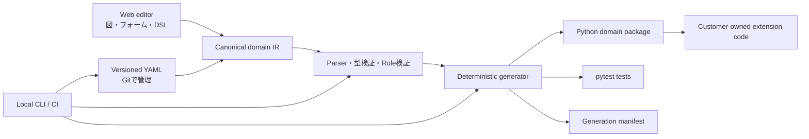

# 05. Code Generation and Architecture

## 1. 構成案



## 2. 生成契約

### 必須の性質

- **決定的:** 同一モデル、設定、generator版ならファイル内容が同一。
- **差分生成:** 新規・更新・削除予定を実書き込み前に表示。
- **所有境界:** Generated領域は再生成可能。Extension領域はツールが更新しない。
- **読みやすさ:** 出力に意味のあるクラス名、メソッド名、docstring、型注釈を付ける。
- **一般的な実行:** 標準Pythonツールと通常のCIで動く。
- **削除の安全性:** モデルから削除したファイルは自動削除せず、stale候補として警告するか明示的承認を求める。
- **失敗時の原子性:** 生成エラーやユーザー取消しで一部ファイルだけ更新された状態を作らない。

### 生成ディレクトリ案

```text
src/<package_name>/
  generated/
    domain/
      entities.py
      value_objects.py
      aggregates.py
      errors.py
      events.py
      commands.py
      invariants.py
    application/
      use_cases.py
      ports.py
    model_manifest.json
  extensions/
    domain/
    application/
tests/
  generated/
```

顧客の好みでモジュール分割を設定できるようにするが、MVPでは出力構造を限定し、安定した拡張契約を優先する。

## 3. 手書きコードとの接続

- 自動生成されたクラスに顧客コードを直接追記させない。
- 生成ファイルから呼び出す抽象Port、拡張関数、基底クラスのいずれかを提供する。
- 拡張ポイントは名前と型をモデルに登録し、未実装箇所を診断する。
- GeneratorのバージョンアップでExtension APIを破壊する場合は変更前に差分を出す。
- 生成物への手編集を検知した場合、黙って上書きせず差分を表示して停止する。

## 4. Python出力の初期方針

- Pythonを最初の生成対象にする。
- Python 3.11以上を暫定ターゲットとし、正式サポート範囲はPoC開始前に固定する。
- 型注釈、標準的なEnum、UUID、datetime、Protocol / ABC等を利用する。
- Value Objectは不変を既定にする。
- Entity / Aggregateは外部からの直接変更を避け、名前付き操作を通す。
- Pydantic v2を使う生成Profileを初期候補とする。標準ライブラリだけのProfileを求める顧客数をPoCで調べる。
- 生成結果はpytestで実行でき、mypyまたはpyrightのどちらを公式サポートするかを定める。
- Domain ErrorはHTTPやFastAPIの型から独立させる。
- 時計、ID生成、Repository、イベント通知などの外部依存はPortまたは明示入力にする。

## 5. ドメインコード生成の意味論

### Invariant

1. 入力フィールドの型・制約を検証する。
2. Invariant式を評価する。
3. 違反時は宣言されたDomain Errorを送出し、無効インスタンスを返さない。
4. 状態遷移時は候補状態を作り、全Invariantを通過した場合だけ結果を確定する。

### StateGuard

- Guardオブジェクトまたは等価な型付きAPIを生成する。
- `checks()`でboolを返す。
- `assert_holds()`で条件成立時は継続し、違反時は宣言Errorを送出する。`assert`はPythonの予約語として扱う。
- 操作側がGuardを自動適用するか、呼び出し側へ委ねるかをモデル上で明示する。
- Guard条件とOperationの対応をドキュメントへ出す。

### Use Case

- 入力検証、Port呼び出し、Domain操作、保存、イベント公開順を明示する。
- Domain操作をHTTP handlerに直接結合しない。
- トランザクション境界とイベント公開タイミングの保証を設定に記録する。
- 再試行がある処理はidempotency keyの必要性を診断する。

## 6. WebとCLIの責務

### Web SaaS

- モデル編集、図、共同レビュー、診断、ドキュメント表示、ユーザー・課金管理を担う。
- 顧客のソースコードやSecretを既定で保存しない。
- Webでの生成はダウンロード可能なレビュー用結果に限り、顧客リポジトリへの書き込みには明示承認を要する。

### Local CLI

- モデル検証とコード生成の正規実行環境。
- オフライン利用可能。Webログインを必須にしない基本機能を提供する。
- CI上で固定版を実行し、モデルと出力の差分を検査する。
- ライセンスや有料機能確認で通信する場合は、送信データと頻度を明記し、失敗時の動作を契約する。

## 7. AI拡張の位置づけ

- AIはモデルから欠けた意味を推測して確定しない。
- 曖昧な箇所を質問し、回答をモデル差分へ反映する。
- AI生成コードにはシナリオ由来テスト、未カバー条件、推測箇所を添付する。
- 生成コードの所有権、学習利用、外部送信、保持期間をプランと設定で明示する。
- AIなしでもモデル検証と決定的生成が成立する。
