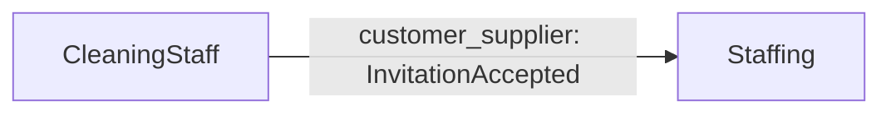

<!-- Generated by DDD Presenter from model "cleaning-platform". DO NOT EDIT. -->

# CleaningStaff

清掃スタッフの招待・受諾・取り消しを扱う

## Glossary

| Term | Definition |
|---|---|
| Invitation | 清掃会社がスタッフ候補へ送る参加依頼。期限内に受諾できる。 |
| 受諾 | 招待を受けたスタッフが参加を確定すること。 |

## Rules

| Rule | Kind | Owner | Condition | Error | Applied by | Tested by |
|---|---|---|---|---|---|---|
| `expiry_after_creation` | Invariant | CleaningStaffInvitation | `expires_at > created_at` | InvalidInvitationWindow | construct `CleaningStaffInvitation`, factory `issue`, operation `accept`, operation `revoke` | `test_invariant_cleaning_staff_invitation_expiry_after_creation` |
| `accepted_invitation_has_accepted_at` | Invariant | CleaningStaffInvitation | `status != accepted or accepted_at != null` | InvalidInvitationWindow | construct `CleaningStaffInvitation`, factory `issue`, operation `accept`, operation `revoke` | `test_invariant_cleaning_staff_invitation_accepted_invitation_has_accepted_at` |
| `pending_until_expiry` | StateGuard | CleaningStaffInvitation | `status == pending and at < expires_at` | InvitationNotDeliverable | operation `accept` | `test_expired_invitation_is_rejected` |
| `is_open` | StateGuard | CleaningStaffInvitation | `status == pending` | InvitationAlreadyClosed | operation `revoke`, use_case `revoke_invitation` | `test_revoked_invitation_cannot_be_revoked_again` |

## Aggregate CleaningStaffInvitation

スタッフ候補への招待

| Operation | Requires (auto) | Changes | Emits |
|---|---|---|---|
| `issue` (factory) | — | all fields | InvitationIssued |
| `accept` | `pending_until_expiry(at)` | status, accepted_at | InvitationAccepted |
| `revoke` | `is_open` | status | InvitationRevoked |

## Use case issue_invitation

スタッフ候補へ招待を発行する

- Class: `IssueInvitationUseCase`, command: `IssueInvitation`
- Actor: 清掃会社の管理者
- Transaction: required
- Scenarios: `invitation_is_issued`, `blocked_email_is_rejected`, `past_expiry_is_rejected`

## Use case accept_invitation

招待を受諾する

- Class: `AcceptInvitationUseCase`, command: `AcceptInvitation`
- Actor: スタッフ候補
- Transaction: required
- Scenarios: `pending_invitation_is_accepted`, `expired_invitation_is_rejected`, `unknown_invitation_is_not_found`

## Use case revoke_invitation

- Class: `RevokeInvitationUseCase`, command: `RevokeInvitation`
- Actor: 清掃会社の管理者
- Transaction: required
- Scenarios: `open_invitation_is_revoked`, `closed_invitation_is_left_untouched`

## Context map

| Upstream | Downstream | Pattern | Events | Consumed by |
|---|---|---|---|---|
| CleaningStaff | Staffing | customer_supplier | InvitationAccepted | `Staffing.register_staff_on_acceptance` |
