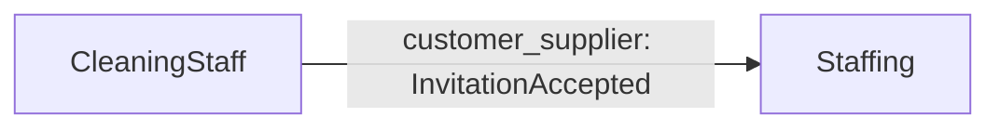

<!-- Generated by DDD Presenter from model "cleaning-platform". DO NOT EDIT. -->

# Staffing

招待を受諾した人をスタッフとして登録する（CleaningStaff の下流）

## Glossary

| Term | Definition |
|---|---|
| スタッフ | 清掃の仕事を割り当てられる人。招待の受諾をきっかけに登録される。 |

## Aggregate StaffMember

登録済みのスタッフ

| Operation | Requires (auto) | Changes | Emits |
|---|---|---|---|
| `register` (factory) | — | all fields | StaffRegistered |

## Use case register_staff

招待を受諾した人をスタッフとして登録する

- Class: `RegisterStaffUseCase`, command: `RegisterStaff`
- Actor: システム（ポリシー）
- Transaction: required
- Scenarios: `accepted_invitation_registers_staff`

## Policies

| Policy | When | Runs | Args |
|---|---|---|---|
| `register_staff_on_acceptance` (`RegisterStaffOnAcceptancePolicy`) — 招待が受諾されたらスタッフとして登録する | CleaningStaff.InvitationAccepted | `register_staff` | invitation_id=`event.id`, joined_at=`event.at` |

Wire the handlers into an event bus with `subscriptions()` in `application/policies.py`.

## Context map

| Upstream | Downstream | Pattern | Events | Consumed by |
|---|---|---|---|---|
| CleaningStaff | Staffing | customer_supplier | InvitationAccepted | `Staffing.register_staff_on_acceptance` |
